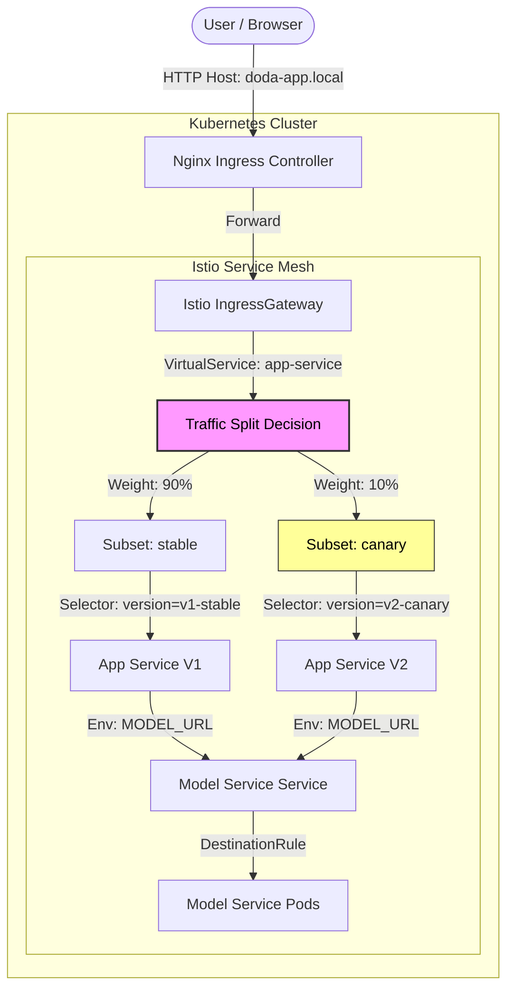

# Final Deployment Documentation

## 1. Deployment Overview

The DODA application is deployed as a distributed microservice architecture on a Kubernetes cluster. The system leverages **Istio Service Mesh** for advanced traffic management, enabling Canary releases and fine-grained routing control.

### Service Inventory
*   **App Service (Frontend):** A Spring Boot application serving the UI and API gateway logic.
*   **Model Service (Backend):** A Python/FastAPI service hosting the machine learning model.
*   **Infrastructure:**
    *   **Nginx Ingress Controller:** Handles external entry into the cluster.
    *   **Istio IngressGateway:** Bridges external traffic to the service mesh.
    *   **Prometheus & Grafana:** Provides observability and dashboards.

## 2. Request Data Flow & Traffic Routing

The following diagram illustrates how a user request flows through the system, highlighting the **90/10 Canary Split** implemented in Assignment 4.

### Key Traffic Decisions

1.  **Ingress (Edge):**
    *   Traffic enters via MetalLB (IP `192.168.56.90`).
    *   The `Ingress` resource routes `doda-app.local` to the Istio Gateway.

2.  **Traffic Splitting (The Experiment):**
    *   The **VirtualService** (`app-service-virtualservice`) intercepts traffic destined for `app-service`.
    *   It applies a weighted routing rule:
        *   **90%** of traffic is sent to the `stable` subset.
        *   **10%** of traffic is sent to the `canary` subset.

3.  **Version Selection:**
    *   The **DestinationRule** maps these subsets to specific Kubernetes labels:
        *   `stable` -> `version: v1-stable`
        *   `canary` -> `version: v2-canary`

 4. **Sticky Sessions (Session Persistence):**
    * To ensure a consistent user experience during our continuous experiment, we implemented **Sticky Sessions** using Istio’s **Consistent Hashing**.
    * The system uses the `x-user-id` HTTP header as the hash key. This ensures that a specific user is consistently bound to either the `stable` or `canary` version throughout their session, preventing them from seeing different versions on page reloads.

## 3. Configuration Details

To interact with the deployment, the following configuration is used:

| Resource | Value / Setting | Description |
| :--- | :--- | :--- |
| **Hostname** | `doda-app.local` | Mapped in local `/etc/hosts` to the LoadBalancer IP. |
| **Metrics** | `metrics.doda-app.local` | dedicated host for Prometheus scraping. |
| **Dashboard** | `dashboard.local` | Kubernetes Dashboard (SSL enabled). |
| **Model** | `http://model-service:80` | Internal DNS name used by the App to reach the Backend. |

 ## 4. Additional Use Case: Local Rate Limiting

 To protect the backend resources, we implemented **Rate Limiting** as our additional use case. 
 * **Implementation:** This is applied to the `model-service` via an `EnvoyFilter` (defined in `istio-envoyfilter.yaml`).
 * **Logic:** It restricts users to a token bucket defined by `burstSize` and `fillInterval` configured in `values.xml`. 
 * **Effect:** If a user exceeds the limit, the filter returns a `429 Too Many Requests` response and appends the header `x-local-rate-limit: true`. This prevents a single user from exhausting the compute resources of the model service.